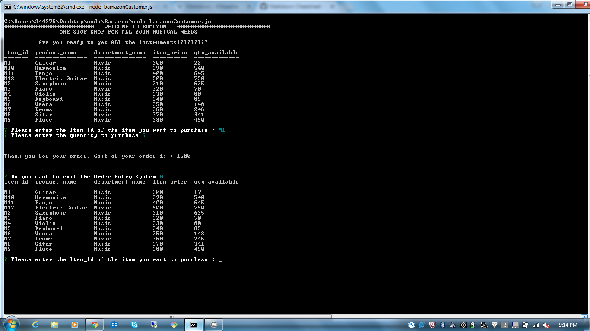
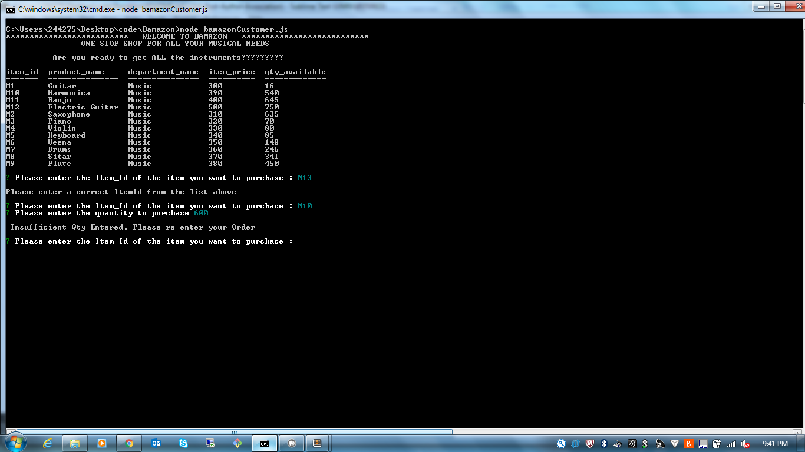

# Bamazon
Amazon store front like functionality with node and mysql. This is only a CLI.

---

* On launch it shows the details of the items, cost per unit, and quantity available in a table format.

* After displaying the above details, it asks two questions to capture Item_Id and Quantity.

* If valid Item_Id and Quantity, accepts the order, updates the quantity for that item in the database and shows the cost of the order. Then it shows a Y/N prompt to ask if we want to exit the Order Entry System. If 'N' is chosen, it displays the item table again and prompts for a new order info (Item_Id) and quantity to be entered.

* If invalid Item_Id entered, it prompts again for correct Item_Id

* If valid Item_Id entered but quantity more than available is entered...it displays an error message and prompts for both Item Id and Quantity again.

* Please see the screenshots

Valid Item Id and Quantity - No error messages :

Invalid Item Id Or Quantity - With Error Messages and Repeat Prompts to capture correct information :

